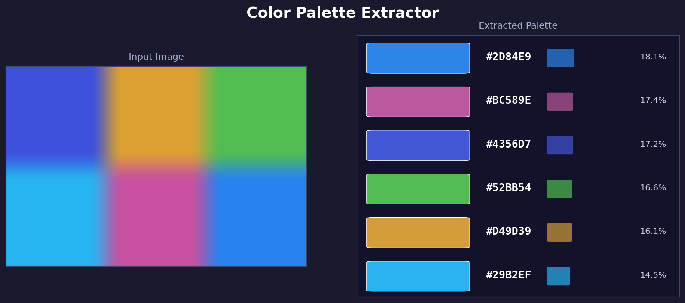

<div align="center">


<br/><br/>

# 🎨 Color Palette Extractor

### *Instantly extract dominant colors from any image using K-Means clustering*

<br/>

> Upload a photo, artwork, logo, or screenshot —  
> get back the **top N dominant colors** with hex codes and percentage breakdowns.

<br/>

[](https://python.org)
[](LICENSE)
[]()
[](https://gradio.app)

</div>

---

## 🖼️ Screenshot

<div align="center">



> *Left: input image — Right: extracted palette with hex codes and coverage %*

</div>

---

## ✨ Features

| Feature | Description |
|---|---|
| 🔢 **Top N Colors** | Extract any number of dominant colors (default: 6) |
| 🎨 **Visual Palette** | Color swatches displayed side by side |
| `#HEX` **Hex Codes** | Copy-ready hex color codes for each swatch |
| 📊 **Coverage %** | How much of the image each color covers |
| 🌐 **Gradio Interface** | Drag-and-drop web UI — no code needed |

---

## 🚀 Quick Start

```bash
# 1. Clone
git clone https://github.com/yourusername/color-palette-extractor.git
cd color-palette-extractor

# 2. Install
pip install -r requirements.txt

# 3. Run
python app.py
```

Then open **http://localhost:7860** in your browser, upload any image, and hit **Extract**.

---

## ⚙️ How It Works

```
📷  Upload Image
        │
        ▼
🔘  Convert BGR → RGB
        │
        ▼
📐  Reshape image into flat list of pixels
    (width × height) × 3 RGB values
        │
        ▼
🤖  K-Means Clustering ──────────── groups pixels into K color clusters
        │                            each cluster = one dominant color
        ▼
🏆  Extract cluster centers ──────── these are the dominant colors
        │
        ▼
📊  Count pixels per cluster ─────── compute % coverage per color
        │
        ▼
🎨  Convert centers → HEX codes
        │
        ▼
🖼️  Render palette swatches + export
```

### Why K-Means?

K-Means groups pixels by color similarity in RGB space. Each "cluster center" is the average color of all pixels assigned to it — which gives you the most representative color for that group. The more pixels in a cluster, the higher its coverage percentage.

---

## 🗂️ Project Structure

```
color-palette-extractor/
│
├── app.py                  ← Gradio web interface (run this)
├── palette.py              ← Core extraction logic
├── requirements.txt        ← Dependencies
├── palette_screenshot.png  ← Sample output
└── README.md               ← This file
```

---

## 📦 Tech Stack

```
Python 3.8+
├── opencv-python     — image loading and color conversion
├── numpy             — pixel array manipulation
├── scikit-learn      — K-Means clustering algorithm
└── gradio            — web interface
```

---

## 💻 Core Logic (simplified)

```python
import cv2
import numpy as np
from sklearn.cluster import KMeans

def extract_palette(image_path, k=6):
    img = cv2.imread(image_path)
    img = cv2.cvtColor(img, cv2.COLOR_BGR2RGB)

    # Flatten image to list of pixels
    pixels = img.reshape(-1, 3).astype(np.float32)

    # Cluster pixels into K color groups
    kmeans = KMeans(n_clusters=k, random_state=42)
    kmeans.fit(pixels)

    # Get dominant colors + coverage %
    colors   = kmeans.cluster_centers_.astype(int)
    _, counts = np.unique(kmeans.labels_, return_counts=True)
    percents = (counts / counts.sum() * 100).round(1)

    # Convert to hex
    hex_codes = ["#{:02X}{:02X}{:02X}".format(*c) for c in colors]

    return colors, hex_codes, percents
```

---

## 🔭 Future Improvements

- [ ] Export palette as **CSS variables** (`:root { --color-1: #ff6b6b; }`)
- [ ] Export as **JSON** for use in design tools
- [ ] **Multi-palette modes** — vibrant, muted, pastel variants
- [ ] Side-by-side comparison of different K values
- [ ] Automatic **color naming** (red, sky blue, forest green, etc.)
- [ ] Palette history — save and compare palettes across images
- [ ] **Download palette** as a PNG swatch sheet

---

## 🎯 Use Cases

- 🎨 **Designers** — extract color palettes from inspiration images
- 🖼️ **Artists** — analyze dominant colors in artworks
- 🌐 **Web devs** — pull brand colors from logos or screenshots
- 📱 **App devs** — generate theme colors from a hero image
- 📊 **Data viz** — build color-matched chart palettes

---

## 📋 Requirements

```txt
opencv-python>=4.5.0
numpy>=1.20.0
scikit-learn>=1.0.0
gradio>=3.0.0
```

---

<div align="center">

Made with K-Means + Python

⭐ Star this repo if it helped you!

</div>
